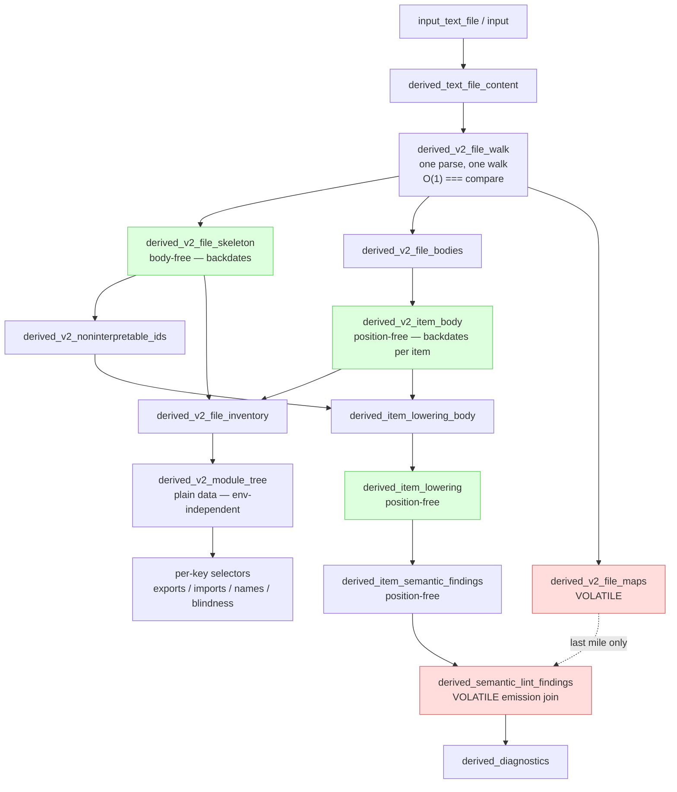
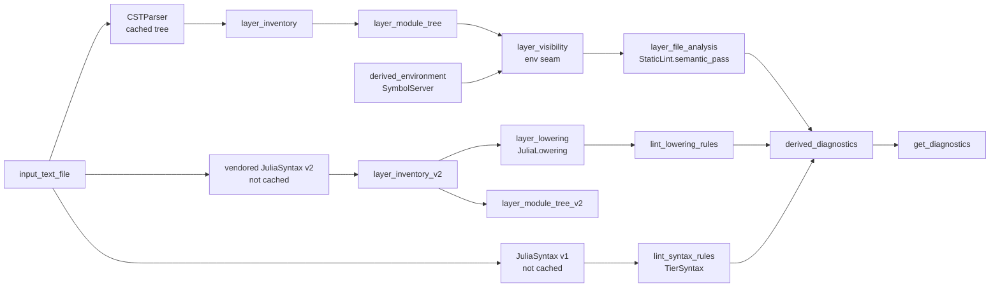

# The v2 analysis stack

*Design note, 2026-08-20. Companion to [`docs/src/architecture.md`](../src/architecture.md),
which describes the engine as a whole; this note describes the **v2 static-analysis
stack** in `src/v2/` and how it sits inside that engine.*

Every section that has a shipping counterpart ends with a

> **Shipping today (v1)** — …

aside naming the v1 file and how it differs. "v1" here means the stack that
actually runs for users: CSTParser + StaticLint + `layer_inventory.jl` /
`layer_module_tree.jl` / `layer_visibility.jl` / `layer_file_analysis.jl`.

---

## 1. Orientation: two stacks in one module

Both stacks are `include`d into the same `JuliaWorkspaces` module, so they share
inputs, share `types.jl`, and share the diagnostics join — but nothing else.

- **v2 is everything under `src/v2/`, and nothing outside it.** That is a
  literal rule, not a slogan: v2 is CSTParser-free and StaticLint-free by
  construction, and a guard testitem in `test/v2/test_inventory_v2.jl` enforces
  it. If v2 code appears to need `derived_file_inventory` or `CSTParser`, the
  correct conclusion is that a v2 layer is missing, not that the rule bends.
- **One include line**: [`src/packagedef.jl:29`](../../src/packagedef.jl) →
  `include("v2/v2.jl")`, sitting after `layer_module_tree.jl` and before
  `layer_visibility.jl`.
- **Inert by default.** The whole stack hangs off the `input_lowering_lint`
  feature flag, which lazily defaults to `false`. With the flag off, no v2 query
  is ever demanded and diagnostics behave exactly as they do today.

The complete set of touchpoints with the rest of the package — four files, and
that is the entire coupling surface:

| File | Touchpoint |
| --- | --- |
| [`src/inputs.jl`](../../src/inputs.jl) | the `input_lowering_lint` feature flag |
| [`src/layer_diagnostics.jl`](../../src/layer_diagnostics.jl) | pulls v2 findings in / suppresses StaticLint's for the same rule ids |
| [`src/public.jl`](../../src/public.jl) | `set_lowering_lint!` |
| [`src/packagedef.jl`](../../src/packagedef.jl) | the single include |

Inside `src/v2/` the load order is the layering
([`src/v2/v2.jl`](../../src/v2/v2.jl)):

```
body_tree.jl        the value type every analysis layer is written against
item_ids.jl         content-addressed item identity
macro_tables.jl     macro-effect tables for the walker
vendor_lowering.jl  vendored JuliaSyntax v2 + JuliaLowering
├ layer_inventory_v2.jl    Layer 1 — walker, skeleton, body forest, range maps
├ layer_module_tree_v2.jl  Layer 2 — module structure across include edges
├ layer_lowering.jl        Layer 3 — JuliaLowering binding analysis per item
└ lint_lowering_rules.jl   Layer 4 — the rules that consume it
```

---

## 2. The substrate: Salsa, in one paragraph

There are exactly two kinds of node in the engine: **inputs** (`@declare_input`,
the only mutable state) and **derived queries** (`@derived`, pure functions that
Salsa memoizes and invalidates automatically). The property everything below
turns on is **early cutoff** — also called *backdating*: when a query recomputes
and its new result is `isequal` to the old one, Salsa stops propagating
invalidation there, and nothing downstream reruns. A "layer" is not a construct;
it is a file-level convention, and the include order *is* the layering. See
[`docs/src/architecture.md`](../src/architecture.md) for the full treatment.

The single design idea running through all of v2 is: **arrange values so that
they backdate.** Everything else — the position-free trees, the skeleton/body
split, the separate id space — falls out of that.

---

## 3. The shared base below both stacks

| File | What both stacks get from it |
| --- | --- |
| [`src/inputs.jl`](../../src/inputs.jl) | `input_files`, `input_text_file`, the readiness collections, `input_lowering_lint` |
| [`src/layer_files.jl`](../../src/layer_files.jl) | which files exist, `derived_has_content`, `derived_text_file_content` |
| [`src/layer_syntax_trees.jl`](../../src/layer_syntax_trees.jl) | parsing entry points and TOML parsing |
| [`src/types.jl`](../../src/types.jl) | `SourceText`, `TextFile`, `Diagnostic`, the project/test model |

The two stacks parse the same bytes independently and never exchange trees: v1
via CSTParser (plus JuliaSyntax v1 for syntax diagnostics), v2 via the vendored
JuliaSyntax v2. There is no cross-parser byte matching anywhere in v2 — the
thing that makes that affordable is the subject of the next section.

---

## 4. Why we no longer cache syntax trees

This is the design decision that surprises people most, so it is argued here
rather than asserted. The numbers below were measured on 2026-08-20 over this
repository's own `src/` tree (86 `.jl` files, 1.29 MiB of source, Julia 1.12.7),
not quoted from the code comments.

### 4.1 What the code actually does today

- [`parse_julia_syntax_tree`](../../src/layer_syntax_trees.jl) is deliberately a
  **plain function, not a derived query**. Callers parse on demand and cache
  only their small, structurally-comparable outputs.
- `derived_julia_legacy_syntax_tree` in the same file **is** still a cached
  derived query. So the shipping engine does cache a parse tree for every Julia
  file — the CSTParser one. This is the inconsistency the rest of this section
  is really about, and it is called out again at the end.
- v2 caches no parser tree either. `derived_v2_file_walk` parses, walks once,
  and keeps only distilled products. What it retains *is* tree-shaped — the
  `BodyTree` forest — but position-free and structurally hashed, which is
  precisely what a `SyntaxNode` cache can never be.

### 4.2 The measurements

Retention, for 1.29 MiB of source:

| Cached value | Size | × source |
| --- | ---: | ---: |
| JuliaSyntax `SyntaxNode` trees, all files | 28.1 MiB | 21.7× |
| CSTParser trees, all files (**cached today**) | 20.9 MiB | 16.1× |
| v2: skeletons + bodies + maps | 15.0 MiB | 11.6× |
| v2: skeletons alone | 0.28 MiB | 0.2× |

Cost of recomputing instead of caching:

| Operation | per file | whole `src/` |
| --- | ---: | ---: |
| JuliaSyntax parse | 0.62 ms | 53 ms |
| CSTParser parse | 0.40 ms | 34 ms |
| v2 parse + walk | 1.46 ms | 126 ms |

And the property that decides the matter — insert one comment line at the top of
`src/layer_completions.jl` (93 top-level items) and re-derive everything:

| Value | Unchanged after a position-only edit? |
| --- | --- |
| JuliaSyntax `SyntaxNode` | ✗ (`isequal` is identity) |
| CSTParser tree | ✗ |
| v2 skeleton | ✓ |
| v2 item bodies | ✓ 93 of 93 |
| v2 address→range maps | ✗ 0 of 93 (volatile by design) |

A body-only edit inside one function, for contrast: skeleton unchanged, item ids
stable, and only the edited item's body differs.

### 4.3 The principle

**Cache what backdates; recompute what doesn't.**

A memoized value pays for its memory with early cutoff. A value whose `isequal`
is identity can never provide early cutoff, because a fresh parse always
produces a fresh object. Caching it therefore buys nothing at all — it is pure
retention, and it retains the *largest* value in the system (20× the source it
came from) to save the *cheapest* computation in the system (sub-millisecond).
That is the wrong side of every trade at once.

Worse, it is actively harmful: a cached tree that never backdates is an
invalidation *amplifier*. Every consumer that depends on it reruns on every
keystroke, no matter how irrelevant the edit, because the dependency edge always
reports "changed".

### 4.4 But rust-analyzer caches its parse — so why don't we?

It does, and this is the strongest objection. Four things separate the cases.

1. **Its tree is built to be cached.** rowan green trees are immutable,
   refcounted and interned: identical subtrees are physically shared, cloning is
   a refcount bump, and structural equality is cheap. A green tree genuinely can
   compare equal after a reparse. `SyntaxNode` has none of those properties.
2. **It reparses incrementally.** An edit confined to a block reuses the
   surrounding green nodes, so the memoized value is frequently *literally the
   same object*. JuliaSyntax rebuilds from scratch every time.
3. **It bounds the cache.** rust-analyzer puts an LRU capacity on the parse
   query. Salsa.jl has no eviction, LRU, or GC of any kind — verified: nothing
   of the sort exists in `Salsa/src/`. Here, "cache the tree" means "retain
   every tree for the lifetime of the process".
4. **It still builds our exact firewall on top.** This is the part worth
   internalising: caching the tree did *not* spare rust-analyzer from needing a
   position-free layer. It has all three of our products, under different names:

   | rust-analyzer | v2 here |
   | --- | --- |
   | `ItemTree` — position-free per-file item summary | `V2FileSkeleton` / `derived_v2_file_skeleton` |
   | `AstIdMap` — stable id → syntax pointer | the address→range maps, `derived_v2_file_maps` |
   | per-definition body lowering queries | `derived_v2_item_body` → `derived_item_lowering` |

   The tree cache sits *below* that firewall as an optimization. It is never a
   substitute for it.

So the decision is not "syntax trees aren't worth caching". It is: *caching this
tree representation, under this Salsa, costs a lot and cuts off nothing.* The
honest list of what would flip the answer — any one of a green-tree/interned
JuliaSyntax representation, incremental reparse, or LRU support in Salsa.jl.
Until then, the ~0.6 ms reparse is the cheaper half of the trade.

> **Shipping today (v1)** — v1 does exactly what this section argues against:
> `derived_julia_legacy_syntax_tree` retains a CSTParser tree per file (20.9 MiB
> for this repo's `src/`) that can never backdate. It survives because the v1
> feature layers pass raw EXPR pointers around and would need the tree rebuilt
> at every call site otherwise. By the argument above, that cache — not the
> JuliaSyntax one — is the one that should go.

---

## 5. The v2 invalidation contract

Three rules, stated once here because every layer below depends on all of them.

### 5.1 `BodyTree` is position-free and trivia-free

[`src/v2/body_tree.jl`](../../src/v2/body_tree.jl). A `BodyTree` contains only
plain data — kinds, leaf values, children — and **never** a byte offset, a
`SyntaxTree` reference, an objectid, a file name, or a runtime handle. Two trees
are `isequal` iff the item's parsed content is identical, regardless of where the
item sits in the file or what whitespace and comments surround it. The structural
hash is computed once at construction, so Salsa's comparison is cheap.

One consequence worth spelling out, because it cost real effort: the vendored
parser's EST stores an `Expr`-style `LineNumberNode` — file name *and* line — as
the second child of every macrocall. Stored verbatim, that is a position inside a
value whose entire contract is to be position-free, and it lands in the
structural hash. Measured over this package, 39% of items (130 of 330) contain
one — every item with any macrocall in it, including every `@assert` inside a
function body. They are normalized to a single sentinel, with the *type*
preserved so JuliaLowering still sees the shape it expects.

### 5.2 Positions come back only at the last mile

Addresses are **preorder indices** into the body tree (root = 1). Tree and map
are produced by the same walk, so addresses always align. The map is **volatile**
by design: it changes on every reparse. Depending on a map from an analysis-layer
computation is a bug; only last-mile assembly — joining node addresses to ranges
for emission — may read one.

### 5.3 Item ids are content-addressed, and the id space is private

[`src/v2/item_ids.jl`](../../src/v2/item_ids.jl). An id identifies a top-level
statement by *what it declares*, not where it sits, so inserting a line above a
definition does not renumber everything below it. The id is 62 bits: a 46-bit
hash of `(coarse kind, name as written, in-file module path)` plus a 16-bit
disambiguator counting earlier statements with the same key.

The key is a **hint**. Statements sharing a key are separated by the
disambiguator, and an explicit probe over already-assigned ids guarantees
uniqueness, so a coarse — or even wrong — key costs id *stability*, never
*correctness*.

`V2ItemRef` is structurally identical to v1's `ItemRef` but a deliberately
distinct type. The two walkers enumerate different statement sets over different
parsers, so the id spaces do not agree and never will; a distinct type turns a
mix-up into a method error instead of a silent lookup miss, and gives Salsa
distinct cache keys. **Never compare ids across pipelines.**

> **Shipping today (v1)** — v1 uses the same *scheme* in
> [`src/layer_inventory.jl`](../../src/layer_inventory.jl) (`ItemRef`,
> `_mint_ids!`) and reattaches positions through `derived_item_positions`, its
> own volatile leaf. v2 owns a private copy of all of this machinery on purpose:
> the two pipelines share the design, never the code, so neither constrains the
> other and v1 can eventually be deleted outright.

---

## 6. Layer 1 — inventory: one parse, one walk, three products

[`src/v2/layer_inventory_v2.jl`](../../src/v2/layer_inventory_v2.jl) (984 lines),
plus [`macro_tables.jl`](../../src/v2/macro_tables.jl).

This is the single source of truth for v2 item identity, and the reason the stack
can be CSTParser-free. One traversal of one parse yields three products, split
into separate Salsa queries **because they have three different invalidation
behaviours**:

| Query | Contains | Behaviour |
| --- | --- | --- |
| `derived_v2_file_skeleton` | the file's API shape: item rows, imports, exports, includes, modules, opaque macros — **no bodies** | backdates on any edit that doesn't change the top-level API |
| `derived_v2_file_bodies` → `derived_v2_item_body` / `_body_hash` | per-item `BodyTree`s | each item backdates *individually* |
| `derived_v2_file_maps` | id → address→byte-range vectors | **volatile**: recomputes on every reparse |

The bundle they project from, `V2FileWalk`, is deliberately a **plain struct, not
`@auto_hash_equals`**: Salsa's early-exit comparison on the bundle would be an
O(file) walk that *always* fails, since the maps shift on any position edit.
Default `==` is `===`, so that comparison is O(1) and the real early cutoff
happens in the three projections.

**Classification** is one Salsa hop away. The skeleton's `V2ItemRow.kind` is the
*coarse* head kind and is deliberately body-independent (`:struct` covers both
mutabilities) so the skeleton stays insensitive to body edits and the id key stays
stable. `derived_v2_item_classification` refines it per item into `V2Decl`s — one
statement can declare several names (`a, b = 1, 2`; `@enum Color red green`) —
and `derived_v2_file_inventory` joins the two into the v1-shaped view.

**Macros.** The walker cannot expand macros, so for every top-level macrocall it
answers one question: might this expansion define names the walk would otherwise
miss? "No" (`V2_EFFECT_FREE_MACROS`, `V2_HANDLED_MACROS`) lets the walk stay
sighted; "yes" records a `V2OpaqueMacro`, which marks the enclosing module blind
in the same way a wildcard `using` does. Membership is tested by *name* — the
weaker but necessary choice, since a syntax-only walk cannot resolve identity,
and an unresolved name must keep its name verdict or the verdict would flip as
indexing completes. A separate table, `DEFINITION_SHAPED_DSL_MACROS`, marks items
whose argument merely *looks* like a definition; they are still enumerated and
classified, and only semantic analysis declines them (`interpretable = false`,
projected out as `derived_v2_noninterpretable_ids` so the check is a hash lookup).

The macro tables were seeded from StaticLint's `EFFECT_FREE_MACROS` /
`HANDLED_MACROS` and then owned outright. Divergence is expected, not drift to be
policed: once v2 expands macros for real, most of the effect-free table stops
being a special case at all.

> **Shipping today (v1)** — [`src/layer_inventory.jl`](../../src/layer_inventory.jl)
> walks the CSTParser tree and enforces the same plain-data firewall. Two
> differences bite in practice: it fuses skeleton and classification, and its
> `items` can carry *several rows per id* (one per name of a tuple destructure or
> `@enum`), which is why the v2 emission join iterates the skeleton instead —
> the v1 shape made that loop query and emit the same finding repeatedly.

---

## 7. Layer 2 — module tree

[`src/v2/layer_module_tree_v2.jl`](../../src/v2/layer_module_tree_v2.jl).

`derived_v2_module_tree(rt, root)` splices per-file skeletons together along
include edges into a `V2ModuleTree`: a sorted vector of `V2ModuleNode`s (path,
bareness, declaring item, files, `declared` name→ref map, exports, publics,
resolved imports) plus a file→module-path map.

Include resolution is v2's own: the skeleton carries the *literal* string
argument, and `derived_v2_include_target` resolves it against the including
file's directory. That replaces v1's route through
`StaticLint.collect_include_analysis`, which is what lets the stack stay
StaticLint-free.

Two contracts:

- **Plain data, structural equality.** No syntax nodes, no objectids, no
  offsets — two separately-built trees over the same files must be `isequal`,
  or invalidation cannot stop here.
- **This layer must NEVER depend on `derived_environment`.** Inherited verbatim
  from v1 and equally load-bearing: the tree stays environment-independent so
  that a project resolve or a package update cannot invalidate it.

Body insensitivity is *inherited*, not enforced: this layer consumes
`derived_v2_file_inventory`, whose skeleton half is body-free and whose
per-item classifications backdate individually, so an edit inside a function
body leaves the tree untouched without this layer doing anything.

On top sit cheap per-key selectors — `derived_v2_file_module_path`,
`_module_exists`, `_module_is_bare`, `_module_declared`, `_module_exports`,
`_module_imports`, `_module_names` — the same one-key-per-query pattern used
elsewhere in the engine, so a change to one module doesn't invalidate consumers
of another. Two of them are *blindness flags*:
`derived_v2_module_has_computed_include` (an `include` with a non-literal
argument) and `derived_v2_module_has_opaque_macrocall`. A module flagged either
way may contain names the walk cannot see, so rules that report on *absence*
must stay silent there.

`V2ImportTarget` classifies each import into `:tree` (a module in this root),
`:workspace_package`, `:external`, or `:unresolved`.

> **Shipping today (v1)** — [`src/layer_module_tree.jl`](../../src/layer_module_tree.jl)
> with `ImportTarget` / `ModuleNode`, the same env-independence rule, and the
> same selector pattern. v2's types are identically shaped but private, because
> v1's live in the very files v2 replaces.

---

## 8. Layer 3 — lowering

[`src/v2/layer_lowering.jl`](../../src/v2/layer_lowering.jl) and
[`vendor_lowering.jl`](../../src/v2/vendor_lowering.jl).

This is where v2 stops being a syntax walker and gets real binding semantics —
by running JuliaLowering's own analysis passes, per item.

**The vendoring.** `VendoredLowering` wraps JuliaSyntax v2 + JuliaLowering from
`packages/`. The vendored files are never patched; the wrapper owns every
deviation, and its header lists them exhaustively (six of them: the sibling
`using`, `isdefined`, no `syntax_macros.jl` — it would add methods to `Base`
macro functions inside the LS process — no `precompile.jl`/`__init__`, adjusted
include paths, and `DEBUG = false` for measurably cheaper precompile and
per-item lowering). Keep that list in sync when refreshing the vendored copy.

**The pipeline**, all per item:

```
derived_v2_item_body        position-free BodyTree
  └ derived_item_lowering_body   drops non-interpretable and body-less items
      └ _materialize             BodyTree → vendored SyntaxTree
          └ rebase_layers → expand_forms_1 → expand_forms_2 → resolve_scopes
              └ derived_item_lowering :: ItemLowering
```

`ItemLowering` is plain data: `status` (`:ok`/`:error`), `findings`, `bindings`
(a projection of JuliaLowering's `BindingInfo` — kind, const/ssa/captured,
`is_read`, `is_assigned`, …), and `uses` (resolved identifier → binding id).
Everything is addressed by **preorder address**, never by offset; globals resolve
against a throwaway per-frame anchor module and are recorded as module *names*,
never `Module` objects. `derived_item_lowering` depends on
`derived_item_lowering_body` and nothing else — no map, no file content — which
is what makes it backdate across position-only edits.

**Macro expansion is skipped.** There is no expansion of user macros; macrocalls
are opaque placeholders until DJP-side expansion exists. Three mitigations keep
that from being crippling:

- *Structurally transparent macros* (`TRANSPARENT_MACRO_NAMES`: `@inline`,
  `@propagate_inbounds`, `@nospecialize`, …) are unwrapped without executing
  anything — without this, `@inline f(x, y) = x` hides an entire definition, and
  argument annotations hide entire signatures. This was the largest single source
  of missed bindings in the corpus sweep.
- *Test-block macros* (`@testitem`, `@testset`, …) have their trailing block
  materialized, because test code is code. Only the block form qualifies:
  `@testset for i in …` binds its loop variable in the macro, not the block.
- Inside a genuinely opaque macrocall, every `K"Identifier"` leaf is kept at its
  original address as a plain read. That is conservative in the right direction
  for unused-binding analysis — it can only cause false negatives. **It also
  means use-before-definition analysis must not ship while macros are opaque**,
  since a synthesized read may precede the real assignment.

**Everything degrades.** A per-item lowering failure becomes `status = :error`
with a finding; it never crashes the query, and never takes another item down
with it.

> **Shipping today (v1)** — v1's semantic step is `StaticLint.semantic_pass`,
> driven from [`src/layer_file_analysis.jl`](../../src/layer_file_analysis.jl)
> through the `TreeModuleContext` handle, with
> [`src/layer_visibility.jl`](../../src/layer_visibility.jl) as the environment
> seam. The contrast is the important part: **v1's semantics are per-file and
> environment-aware** (names resolve through the module tree and, for external
> targets, the SymbolServer store); **v2's are per-item and environment-free**.
> v2 currently has no visibility layer at all, which is exactly why it can only
> answer questions that are local to one item — see §10.

---

## 9. Layer 4 — rules, and the join back into diagnostics

[`src/v2/lint_lowering_rules.jl`](../../src/v2/lint_lowering_rules.jl).

**The takeover model: no new rule ids.** When the flag is on, this producer takes
over `LOWERING_TAKEOVER_RULES` — currently `:unused_binding` and
`:unused_function_argument` — from StaticLint. Same ids, same severities, same
presets, same `JuliaLint.toml` surface; different engine. Nothing user-visible
changes shape, which is what makes the experiment switchable.

`derived_lowering_lint_active(rt, uri)` is the gate both producers consult, and
its evaluation order matters: with the flag off, the only Salsa dependency
recorded is the flag input itself, so config edits do not even re-verify it.

The query shape mirrors the syntax-rule engine — a position-free per-item query
plus a volatile per-file emission join:

- `derived_item_semantic_findings(rt, ref)` — position-free, backdates, depends
  only on `derived_item_lowering`. Degradation is silence, never noise.
- `derived_semantic_lint_findings(rt, uri)` — the **only** reader of
  `derived_v2_file_maps` in the stack, joining addresses to byte ranges. Returns
  an empty vector without demanding *any* lowering machinery when the flag is off.

One heuristic deserves a note, because it is the subtle part of unused-binding
analysis on lowered code. One source declaration can produce several lowered
bindings, since desugaring duplicates a pattern into each closure or method it
generates, and two cases pull in opposite directions: a comprehension's filter
closure genuinely *uses* the variable, whereas a default-argument forwarding
method reads its argument purely to pass it on and should not count. What
separates them is *where* the read happens — a genuine use sits at a different
node than the declaration, a synthesized forwarding read carries the
declaration's own address. So a declaration counts as used only when one of its
bindings is read at some *other* address. Names starting with `_` are exempt
throughout, per the convention.

**The join** lives in [`src/layer_diagnostics.jl`](../../src/layer_diagnostics.jl):
`derived_diagnostics` runs each producer, suppresses StaticLint's findings for
any id in `LOWERING_TAKEOVER_RULES` when the takeover is active (no
double-reporting), and funnels *every* producer through `materialize` — the
single place where severity, tags and doc links are applied.

> **Shipping today (v1)** — there are three producers, not two. Besides
> StaticLint's semantic pass there is the purely syntactic tier
> ([`src/lint_syntax_rules/engine.jl`](../../src/lint_syntax_rules/engine.jl),
> `TierSyntax`), which belongs to neither stack: it needs nothing but the
> JuliaSyntax tree of a single file. The tier taxonomy itself — `TierSyntax`,
> `TierSemantic`, `TierProject`, `TierWorkspace` — lives in
> [`src/lint_rules.jl`](../../src/lint_rules.jl) and is shared by all producers.

---

## 10. What v2 does not do yet

This is the honest answer to "how far off is the switchover".

| Missing | Consequence |
| --- | --- |
| Macro expansion | macrocalls are opaque; no use-before-definition rules |
| Environment / SymbolServer seam | nothing external resolves; no missing-reference or call-arity checks |
| A visibility layer (v1's `layer_visibility.jl`) | no cross-module name resolution |
| Feature layers | hover, completions, references, signatures, symbols, navigation, actions, formatting are **all** v1-only |
| Rule coverage | two rules, versus StaticLint's full set |

v2 today is a complete *spine* — identity, skeleton, module structure, per-item
binding semantics — carrying a deliberately small payload. The layers it is
missing are the ones that touch the environment, and those are the expensive
ones.

---

## 11. The picture

The v2 query DAG, with the invalidation behaviour of each node marked:



Green = position-free, backdates. Red = volatile by design; only the emission
join may read a map, and only to reattach ranges at the last mile.

Both stacks, sharing the input and rejoining at the diagnostics layer:



Note what the second diagram shows about the environment: it feeds v1 only. The
dynamic feature (out-of-process indexing, see
[`docs/src/architecture.md`](../src/architecture.md)) gates v1's env-dependent
findings through `derived_file_env_ready`; v2 has no edge to it at all, which is
both why v2 is cheap and why it currently answers so little.

---

## Appendix: measurement method

Reproduce §4.2 in a session with `JuliaWorkspaces` loaded as `JW`:

```julia
files = [joinpath(r, f) for (r, _, fs) in walkdir(joinpath(pkgdir(JW), "src"))
                        for f in fs if endswith(f, ".jl")]
contents = read.(files, String)

# retention
Base.summarysize([JW.parse_julia_syntax_tree(c)[1] for c in contents])   # SyntaxNode
Base.summarysize([JW.CSTParser.parse(c, true) for c in contents])        # CSTParser

# v2 products
function v2walk(c, name)
    root = JW.JS2.parseall(JW.JS2.SyntaxTree, c; filename=name)
    st = JW._v2_walk_file!(JW._V2WalkState(), root)
    (st.skeleton, st.bodies, st.maps)
end
```

Backdating is checked by walking the same file twice, once with a comment line
prepended, and comparing skeletons / bodies / maps with `isequal`.

---

## 12. Follow-up: parse counts, green nodes, and eviction

Three objections raised against §4 on 2026-08-20, answered with measurements on
the same corpus (this repo's `src/`, 86 files, 1.29 MiB, Julia 1.12.7).

### 12.1 Does test item detection trigger its own reparse? Yes — and it is not alone

It does, and the worry behind the question is justified. `JuliaSyntax` v1 is
parsed at exactly four call sites, three of which are demanded during an
ordinary diagnostics pass:

| Call site | Query | Demanded by a diagnostics pass? |
| --- | --- | --- |
| [`layer_syntax_trees.jl:27`](../../src/layer_syntax_trees.jl) | `derived_julia_syntax_diagnostics` | yes |
| [`layer_testitems.jl:105`](../../src/layer_testitems.jl) | `derived_testitems` | yes (`:testitem_errors`) |
| [`lint_syntax_rules/engine.jl:211`](../../src/lint_syntax_rules/engine.jl) | `derived_syntax_lint_findings` | yes |
| [`public.jl:526`](../../src/public.jl) | `get_julia_syntax_tree` | only when the host asks |

So one file, one pass: **three independent JuliaSyntax parses**, plus one
CSTParser parse (cached), plus one vendored-JuliaSyntax parse when v2 is on.
`TestItemDetection.find_test_detail!` wants a `SyntaxNode`, so `derived_testitems`
builds its own.

What that costs, measured:

| | |
| --- | ---: |
| Three JuliaSyntax parses, per file | 1.9 ms |
| Three JuliaSyntax parses, whole `src/` | 159 ms |
| Full warm `get_diagnostics` over `src/` (cold caches) | 1.02 s |
| → parsing as a share of that pass | **15.6%** |
| → the two *redundant* parses | 106 ms, **10.4%** |

That is a real cost and worth removing. Two things keep it from being alarming:

- It is a **bulk/cold-pass** cost, not an interactive one. All three queries are
  memoized, so in steady-state editing only the edited file reparses: ~1.9 ms per
  edit, against a per-file semantic pass an order of magnitude larger.
- The remaining 84% of that pass is StaticLint and the feature layers. Parsing
  three times is wasteful, but it is not what makes an analysis pass slow.

**The fix is not a cached tree.** It is the *fused query* pattern the codebase
already uses twice: `derived_file_include_data` runs one CST walk and exposes
three thin selectors, and `derived_v2_file_walk` does exactly this for v2 — one
parse, one walk, three projections with different invalidation behaviour. The
same shape applies here: one `derived_julia_parse_products(uri)` producing syntax
diagnostics, test details and syntax-rule findings, each behind its own selector
so they keep their independent early cutoff. That removes the redundancy without
putting a `SyntaxNode` into the memo table — the tree stays a local of the fused
query and is collected when it returns. This is the recommended follow-up.

### 12.2 Would returning green nodes make more sense?

JuliaSyntax does support them — `JuliaSyntax.build_tree(GreenNode, stream)` —
and on the two axes §4 complains about, they are a genuine improvement:

| | `SyntaxNode` | `GreenNode` | `BodyTree` |
| --- | ---: | ---: | ---: |
| retention, whole `src/` | 28.1 MiB | **9.1 MiB** | 10.0 MiB (bodies) |
| build, per file | 0.62 ms | 0.56 ms | 1.46 ms (parse + walk) |
| structural `==` / `hash`? | no (identity) | **yes** | yes |

`GreenNode` is `head` + `span` + `children` — spans are *relative widths*, not
absolute offsets — with recursive structural `==` and `hash`. So unlike
`SyntaxNode` it can genuinely backdate, and it is 3.1× smaller. If we ever do
cache a JuliaSyntax tree, it should be this one, not `SyntaxNode`.

But it does not subsume `BodyTree`, for four measured reasons.

1. **Green nodes carry no values.** There is no `val` field: `head`, `span`,
   `children`, nothing else. Measured consequence —

   ```julia
   isequal(green("x = 2\n"), green("x = 3\n"))   # true
   ```

   Both literals are `K"Integer"` with span 1. A green tree is therefore *not* a
   complete record of the parse; it is only complete when paired with the source
   text. Any consumer that needs a literal value or an identifier name must also
   read the text — and the text is what changed — so for exactly those consumers
   the cutoff evaporates. (`BodyTree` sees the same edit: its leaves carry values,
   and its equality is even stricter than leaf `isequal`, since leaf values must
   agree in type too.)

2. **Hash and equality are recomputed, O(tree), on every comparison.** Measured
   on `layer_completions.jl`: `hash(green_tree)` = 1.9 ms, versus 0.0001 ms for a
   `BodyTree`, whose structural hash is computed once at construction and stored
   in the struct — a ~19,000× difference. And green `==` costs 0.21 ms against a
   0.56 ms reparse, so Salsa's early-exit check would cost ~40% of the work it
   saves. Cheap comparison is not incidental to the design; it is the whole point
   of caching the hash in `BodyTree`.

3. **No interning.** rowan's memory win comes from hash-consing: identical
   subtrees are physically one allocation. `build_tree` allocates fresh nodes
   every time and there is no dedup cache, so the 9.1 MiB is ordinary
   per-file retention, not shared structure. The green-tree analogy to rowan
   holds for *shape*, not for *sharing*.

4. **Trivia is in the tree, so the root does not backdate.** Prepending one
   comment line to `layer_completions.jl` makes the whole green tree compare
   unequal — but all **575 of 575** top-level children still compare equal to
   their counterparts. That is the real lesson, and it is the same one §4.4 draws
   about rust-analyzer: **green trees backdate at the subtree level, not the file
   level.** Harvesting that requires keying queries by subtree — which is
   precisely the skeleton/body split v2 already has, done on a representation
   that additionally carries values and caches its hash.

**Verdict.** Green nodes are the right thing to cache if what you need is *a
tree*; `BodyTree` is the right thing to cache if what you need is *backdating*.
v2 needs the latter, so it keeps `BodyTree`. Where green nodes would genuinely
pay off is §12.1's fused query — a shared per-file green tree is 3× cheaper to
retain than a `SyntaxNode` if we ever decide the fused parse should be memoized
rather than local.

### 12.3 The eviction point — the objection is right, and §4.4 stated it too loosely

The objection: eviction is only a problem if the trees were an *input* to a
derived function. That is correct as stated, and the concession is worth making
plainly — **evicting a memoized derived value is always correctness-safe.** It is
recomputable by definition; Salsa just recomputes it on next demand. Being an
input has nothing to do with it. §4.4's third bullet read as if eviction were
unsafe, and it is not.

What actually breaks is *cost*, in three places.

1. **Salsa.jl has no eviction at all.** This part stands and is the practical
   point: the available choice is "retain forever" or "don't cache", not "cache
   with a bound". Nothing resembling an LRU, capacity, or GC exists in
   `Salsa/src/`.

2. **Evicting a non-backdating query cascades.** `parse` is not a leaf — it is
   the base of the entire dependency graph for a file. Evict it, recompute it,
   and the rebuilt `SyntaxNode` is `!isequal` to the one that was dropped, because
   its equality is identity. Salsa therefore cannot validate a single dependency
   edge leaving it, and must re-execute *every* downstream query for that file.
   The cost of the eviction is not the 0.6 ms reparse; it is the semantic pass
   behind it. With structural equality — a green tree — the rebuilt value
   compares equal, invalidation stops immediately, and eviction really does cost
   only the reparse.

   That is the load-bearing asymmetry with rust-analyzer, and it is worth stating
   the causality the right way round: **rust-analyzer can afford an LRU on `parse`
   because rowan backdates.** The bound is cheap *because* of the representation,
   not instead of it.

3. **Evicting would not necessarily free anything here.** rust-analyzer's
   downstream values hold position-free `AstPtr`s, never tree references. v1 does
   the opposite: StaticLint's `meta_dict` is a `Dict{UInt64,StaticLint.Meta}`
   keyed by the **objectid of CST nodes**, and the feature layers pass raw EXPR
   pointers around. A retained downstream memo therefore pins the tree — so
   dropping the cache entry frees no memory — and an objectid-keyed dict that
   outlives the nodes it keys is worse than a leak.

So the accurate version of the §4 argument is not "eviction is impossible". It
is: *without structural equality, the tree is expensive both alive and dead — it
cuts off no invalidation while it is cached, and it cannot be dropped cheaply
because dropping it invalidates everything downstream.* Fix the representation
and both halves of that problem go away at once, which is why §12.2's answer and
this one converge on the same conclusion.

---

## 13. Should test item detection sit on the inventory instead?

Yes — and the case is stronger than "it would save the third parse from §12.1".
Test item detection is the last layer that still ignores the invalidation
contract in §5, and the inventory walk has already done most of its work.

### 13.1 The include order is already right; the data dependency is not

[`src/packagedef.jl`](../../src/packagedef.jl) loads
`layer_testitems.jl` at line 45 — well after `layer_inventory.jl` (27),
`layer_module_tree.jl` (28) and `v2/v2.jl` (29). So by the "include order *is*
the layering" convention, test item detection is already positioned above the
inventory.

It just doesn't *build* on it. `derived_testitems` reaches past every layer below
it, takes `derived_text_file_content`, parses the file itself, and hands the tree
to `TestItemDetection.find_test_detail!` — an external package (v1.2) that wants
a `SyntaxNode`. The layer is in the right place in the file list and in the wrong
place in the dependency graph.

### 13.2 The walk already finds every test item — and throws the finding away

This is the part worth internalising. Both walkers already know the test macros,
by exactly the same five names:

| | |
| --- | --- |
| v1 | `_is_isolated_scope_macrocall` ([`layer_inventory.jl:384`](../../src/layer_inventory.jl)) |
| v2 | `V2_ISOLATED_SCOPE_MACROS` ([`layer_inventory_v2.jl:355`](../../src/v2/layer_inventory_v2.jl)) |
| both | `@testitem`, `@testset`, `@safetestset`, `@testmodule`, `@testsnippet` |

They know them because those macros isolate scope: nothing declared inside binds
at the enclosing level, so the walker emits the macrocall as a **single opaque
item and does not descend**. Which means that for every `@testitem` in the
workspace, `derived_v2_file_walk` has already produced an item id, an order, a
parent module path, a `BodyTree` of the whole macrocall — options, label, body
block and all — and an address→range map entry.

And then `derived_testitems` reparses the file from scratch to find the same
node again.

There are in fact **three** independent implementations of "find the test
constructs" in the tree today: `TestItemDetection` (its own parse),
[`layer_test_setups.jl`](../../src/layer_test_setups.jl) (`@testmodule` /
`@testsnippet`, via the StaticLint analysis), and the two inventory walkers.
Only the middle one follows the plain-data discipline — `TestSetupData` is
`@auto_hash_equals` and position-free.

### 13.3 `TestItemDetail` cannot backdate, by construction

```julia
struct TestItemDetail
    uri::URI
    id::String
    name::String
    code::String                 # the item's source text
    range::UnitRange{Int}        # position
    code_range::UnitRange{Int}   # position
    option_default_imports::Bool
    option_tags::Vector{Symbol}
    option_setup::Vector{Symbol}
    option_skip::Union{Bool,String}
end
```

Two byte ranges and a copy of the source text, in a value whose equality is
structural over all of it. So inserting one blank line at the top of a test file
changes *every* `TestItemDetail` in that file, and `derived_testitems` — plus
everything downstream of it: `derived_diagnostics` via `:testitem_errors`,
`derived_environment`'s test-env resolution, and the public test-listing API —
recomputes in full. This is precisely the pathology §5.2 exists to prevent, in
the one layer that was never converted.

Note also that the id scheme converged independently: `derived_testitems` builds
`"<path relative to package>::<label>"` and appends `#N` when a label occurs more
than once in a file. That is v2's content-addressed id scheme with the label as
the key and the occurrence count as the disambiguator — the same design as
[`item_ids.jl`](../../src/v2/item_ids.jl), arrived at separately, in a different
file, for the same reason ("inserting a test item above another one no longer
renumbers it").

### 13.4 What native support would look like

Follow the split the rest of v2 already uses. Add body-free records to the
skeleton, produced by the walker at the exact point where it currently emits the
opaque item:

```julia
@auto_hash_equals struct V2TestItem
    order::Int
    id::Int64                    # the walker's item id — one id authority
    kind::Symbol                 # :testitem | :testsetup_module | :testsetup_snippet
    label::String
    parent_module::Vector{String}
    option_default_imports::Bool
    option_tags::Vector{Symbol}
    option_setup::Vector{Symbol}
    option_skip::Union{Bool,String}
end
```

No ranges, no `code` string — so it is position-free and backdates. Then the
familiar two-query shape, mirroring `derived_semantic_lint_findings` in §9:

- `derived_v2_file_testitems(rt, uri)` — a projection of the skeleton.
  Position-free; backdates on any edit that doesn't change a label, an option, or
  the set of items.
- the emission join — reattaches `range` and `code_range` from
  `derived_v2_file_maps` and slices `code` out of the text. **Volatile, and the
  only reader of the map**, exactly as the lint join is.

What that buys, beyond deleting one of three parses:

- **Position-only edits stop churning the test list.** Today an edit anywhere
  invalidates every item; afterwards only the range join recomputes, and each
  item's *identity and content* compare equal.
- **"Did this test need re-running?" becomes a query.**
  `derived_v2_item_body_hash(rt, ref)` already answers exactly that, in O(1),
  for any item. Today the only way to ask is to diff `code::String` — which also
  differs when the item merely moved, so a test runner keying off it re-runs
  tests that did not change.
- **One id authority.** The label-plus-occurrence scheme stops being a private
  reimplementation and becomes the walker's, with the human-readable
  `<relpath>::<label>` string derived from it at the boundary.
- **Options get precise invalidation.** Editing `tags=[:slow]` invalidates the
  test-listing consumers and nothing else, instead of everything that touches the
  file.

### 13.5 The honest costs

- **`TestItemDetection` is an external package**, not vendored, with its own
  consumers. Absorbing the detection logic means either taking over its role or
  duplicating it. Per §5.3 v2 would own its copy regardless — the same
  "shared design, never shared code" trade already made for ids and the macro
  tables — so for a while there would be *three* implementations rather than
  today's two-and-a-half, until v1 and the external dependency are retired.
- **The walker must stop being fully opaque here.** It currently emits the
  macrocall as one item and does not descend. Reading the label, the options and
  the body block means parsing the macrocall's own argument shape — `_v2_macro_args`
  already exists for this, but the isolation rule (nothing inside binds outward)
  must be preserved unchanged; only what the walker *looks at* changes, not what
  it enumerates. This is the same distinction `layer_lowering.jl` draws for
  `TEST_BLOCK_MACRO_NAMES`.
- **The error checks are not all position-free.** "Test items must be defined
  inside a Julia package" needs `derived_package_for_file`, and duplicate-label
  detection needs the whole file's list. Neither belongs in the skeleton — the
  first is environment-adjacent and would violate the §7 rule if it leaked into
  the tree. Both go in the join, or in a separate query above it.
- **The runner still needs the volatile half.** `code` and absolute ranges are
  genuinely required to execute a test item. The win is not eliminating the
  volatile value; it is confining volatility to the last mile, so the *decision*
  layer above it stops being volatile with it.

### 13.6 Verdict

Do it, but as part of the §12.1 fused-parse work rather than before it: the two
changes remove the same redundancy from opposite ends, and doing test items
natively in the walker is what makes the third parse deletable rather than merely
shared. Sequence it as (1) native test records in the v2 skeleton behind the
existing flag, (2) the volatile join, (3) point `derived_testitems` at them and
drop the private parse. Steps 1 and 2 are additive and testable against today's
`TestItemDetection` output item for item, which is the cheapest possible way to
prove the walker sees exactly what the external detector sees.
