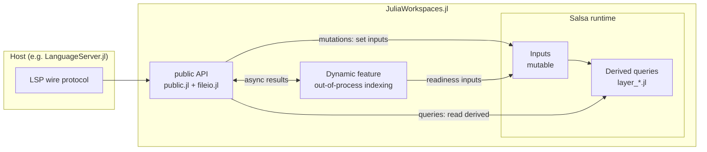
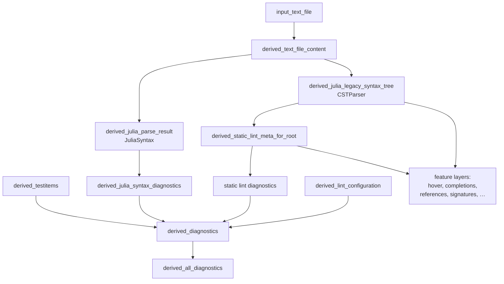
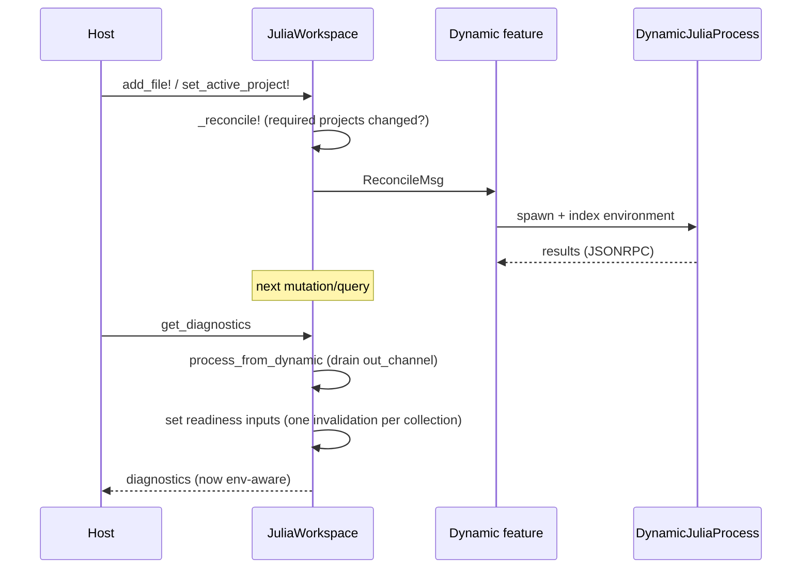

# Architecture

```@meta
CurrentModule = JuliaWorkspaces
```

This page is the primary reference for developers working on
JuliaWorkspaces.jl. It explains the core computational model, how the code base
is organized, and how the different subsystems fit together. Read this before
diving into individual `src/` files.

## Big picture

JuliaWorkspaces.jl is the analysis engine that powers
[LanguageServer.jl](https://github.com/julia-vscode/LanguageServer.jl). Its job
is to take a set of files (Julia sources, `Project.toml`/`Manifest.toml`,
configuration files) and answer questions about them: diagnostics, hover text,
completions, go-to-definition, document symbols, formatting, test items, and so
on.

The whole engine is built as an **incremental, memoized query system** on top of
[Salsa.jl](https://github.com/julia-vscode/Salsa.jl) (inspired by
[rust-analyzer](https://rust-analyzer.github.io/)). Instead of mutable state that
is updated in place, the engine models computation as a graph:

- A small set of **inputs** is the only mutable state.
- Everything else is a **derived query** — a pure function of inputs and other
  derived queries, whose results Salsa caches and invalidates automatically.

When a single file changes, only the queries that transitively depend on that
file recompute; everything else is served from cache. This is what makes the
engine fast enough to run interactively inside an editor, and far easier to
reason about than the older mutable design.



## The Salsa model: inputs and derived queries

There are exactly two kinds of nodes in the query graph.

### Inputs

Inputs are declared with `Salsa.@declare_input` and are the **only** mutable
state in the system. They are written through generated `set_input_*!` setters
and live in [`src/inputs.jl`](https://github.com/julia-vscode/JuliaWorkspaces.jl/blob/main/src/inputs.jl).
The most important ones:

| Input | Meaning |
| --- | --- |
| `input_files(rt)::Set{URI}` | The set of regular workspace files. |
| `input_text_file(rt, uri)` | Per-file content (a [`TextFile`](@ref)). |
| `input_active_project(rt)` | The active/fallback project environment. |
| `input_indirect_text_file(rt, uri)` | Lazy content for a file pulled in via `include` but not explicitly added. |
| `input_package_metadata(rt, ...)` | Lazy per-package symbol metadata, loaded from the `.jstore` cache or requested from the dynamic feature. |
| readiness collections | `input_ready_project_environments`, `input_ready_test_environments`, `input_standalone_projects` — results produced by the dynamic feature. |

Two inputs are **lazy**: the first time they are read they load data
synchronously (from disc, or from the symbol cache) and may notify the host via
a callback (for example to register a file watcher for an indirect file). This
is the seam that makes cross-file `include` resolution transparent to callers.

### Derived queries

Derived queries are declared with `Salsa.@derived`. They are pure functions —
they read inputs and other derived queries and return a value. Salsa memoizes
each call and invalidates it automatically when anything it read changes. There
is **no manual caching anywhere** in the code base; correctness of invalidation
is entirely Salsa's responsibility.

A useful pattern that recurs in [`src/inputs.jl`](https://github.com/julia-vscode/JuliaWorkspaces.jl/blob/main/src/inputs.jl):
dynamic results are stored as a *single collection input* (e.g. one `Set`), but
each key is then exposed through its own tiny derived wrapper
(`derived_project_environment_ready`, `derived_ready_test_environment`, …). This
leverages Salsa's **early-cutoff**: updating the collection only invalidates the
downstream queries whose specific key actually changed, preserving fine-grained
incrementality.

## Layers

A **"layer"** is not a special construct — it is a **file-level organizational
convention**. Each `layer_*.jl` file groups the derived queries for one
functional concern. The files are `include`d in dependency order in
[`src/packagedef.jl`](https://github.com/julia-vscode/JuliaWorkspaces.jl/blob/main/src/packagedef.jl),
so the include order *is* the layering: each layer builds on the ones loaded
before it. Conceptually the layers form a DAG of derived queries, sliced into
files by feature.

From the bottom up:

| Layer file | Responsibility |
| --- | --- |
| `layer_files.jl` | File-set queries: which files exist, which are Julia, and resolving regular-vs-indirect content. |
| `layer_syntax_trees.jl` | Parsing: JuliaSyntax parse results and trees, the legacy CSTParser tree, and TOML parsing. |
| `layer_includes.jl` | The `include(...)` graph and its roots. |
| `layer_static_lint.jl` | Semantic analysis via StaticLint's `semantic_pass`. |
| `layer_projects.jl` | Project/package discovery from `Project.toml`/`Manifest.toml`. |
| `layer_environment.jl` | Resolving which project/environment a file belongs to and building its `ExternalEnv`. |
| `layer_testitems.jl` | `@testitem` / test-setup detection. |
| `layer_diagnostics.jl` | Aggregating syntax, lint, test, and TOML diagnostics, gated by configuration. |
| `layer_hover.jl`, `layer_completions.jl`, `layer_references.jl`, `layer_signatures.jl`, `layer_symbols.jl`, `layer_navigation.jl`, `layer_actions.jl`, `layer_formatting.jl`, `layer_misc.jl` | LSP-feature query layers. |

A crucial design rule: **layers contain no LSP wire types**. They operate purely
on syntax trees, StaticLint data, and SymbolServer stores, and they return the
plain result structs documented in the [Types](types.md) reference (e.g.
[`CompletionResult`](@ref), [`DefinitionResult`](@ref),
[`SignatureResult`](@ref)). Converting those to/from the LSP protocol is the
host's job.



### Two parsers (for now)

Every Julia file is currently parsed **twice**: once with JuliaSyntax (the
target parser) and once with CSTParser (the legacy parser that StaticLint and
the feature layers still depend on). This is a deliberate transitional state —
see [the design transitions](index.md#design-and-roadmap). New code should
prefer JuliaSyntax where practical.

## Core data types

All central types live in
[`src/types.jl`](https://github.com/julia-vscode/JuliaWorkspaces.jl/blob/main/src/types.jl).
Nearly all of them use `@auto_hash_equals`, which is essential: Salsa keys and
memoizes on value equality and hashing, so value semantics are mandatory.

- [`JuliaWorkspace`](@ref) — the central handle: a `Salsa.Runtime` plus an
  optional dynamic feature.
- [`SourceText`](@ref) — string content plus precomputed line indices and a
  language id. [`position_at`](@ref) converts byte offsets to a
  [`Position`](@ref) (1-based line, 1-based UTF-8 byte column).
- [`TextFile`](@ref) — a URI plus `SourceText`; the unit added to a workspace.
- [`Diagnostic`](@ref) — a range, severity, message, optional URI, tags, and a
  source string (e.g. `"JuliaSyntax.jl"`, `"StaticLint.jl"`).
- Project/package model — `JuliaPackage`, `JuliaProject`, the three
  project-entry types (`JuliaProjectEntryDevedPackage`,
  `JuliaProjectEntryRegularPackage`, `JuliaProjectEntryStdlibPackage`), and
  `JuliaTestEnv`.
- Test model — `TestItemDetail`, `TestSetupDetail`, `TestErrorDetail`,
  aggregated in `TestDetails`.
- `SContext` — side-channel context carried by the Salsa runtime (the dynamic
  feature and the indirect-file watch callback).

## The public API: a command/query split

The public surface ([`src/public.jl`](https://github.com/julia-vscode/JuliaWorkspaces.jl/blob/main/src/public.jl)
and [`src/fileio.jl`](https://github.com/julia-vscode/JuliaWorkspaces.jl/blob/main/src/fileio.jl))
is cleanly split into commands and queries over the Salsa runtime.

**Mutations (commands)** — [`add_file!`](@ref), [`update_file!`](@ref),
[`remove_file!`](@ref), [`remove_all_children!`](@ref),
[`set_active_project!`](@ref), [`set_indirect_file_content!`](@ref),
[`clear_indirect_file!`](@ref). Each follows the same pattern:

1. `process_from_dynamic(jw)` — drain any pending async results.
2. mutate inputs via the generated `set_input_*!` setters.
3. `_reconcile!(jw)` — recompute which dynamic processes are required and, if
   that set changed, tell the dynamic feature to spawn/cancel child processes.

Bulk helpers (`_add_file!`/`_remove_file!`) mutate inputs without reconciling so
that an operation like [`add_folder_from_disc!`](@ref) reconciles only once.

**Queries** — thin wrappers that call `process_from_dynamic(jw)` and then read a
derived query: [`get_diagnostics`](@ref), [`get_julia_syntax_tree`](@ref),
[`get_completions`](@ref), [`get_definitions`](@ref),
[`get_document_symbols`](@ref), and so on.

**Disc/boundary helpers** ([`src/fileio.jl`](https://github.com/julia-vscode/JuliaWorkspaces.jl/blob/main/src/fileio.jl)) —
[`workspace_from_folders`](@ref), [`add_folder_from_disc!`](@ref),
[`add_file_from_disc!`](@ref), [`update_file_from_disc!`](@ref), plus path
classifiers (`is_path_project_file`, `is_path_julia_file`, …). These are the
only functions that touch the file system.

## The dynamic feature

The **dynamic feature** ([`src/dynamic_feature/`](https://github.com/julia-vscode/JuliaWorkspaces.jl/tree/main/src/dynamic_feature))
is the only asynchronous, stateful subsystem. Everything else is pure. It exists
to index package environments — work that requires actually loading packages and
therefore cannot be done by static analysis.

Its behavior is controlled by [`DynamicMode`](@ref):

- `DynamicOff` — no child processes; environment-dependent diagnostics are
  suppressed.
- `DynamicIndexingOnly` — spawn child processes to index environments, then tear
  them down (good for CI / one-shot tooling).
- `DynamicPersistent` — keep child processes alive to react to ongoing changes
  (good for a language server).

When enabled, the feature spawns out-of-process `DynamicJuliaProcess` children
and talks to them over JSONRPC, driven by a small finite-state machine
(`dynamic_fsm.jl`) and typed messages (`dynamic_messages.jl`). Children index
project environments, create standalone projects, and fetch package metadata
into the on-disc `.jstore` symbol cache.

Results flow back asynchronously and are folded into the readiness-collection
inputs:



Two consequences worth knowing:

- **Env-readiness gating.** Diagnostics that depend on a resolved environment
  (for example missing-reference warnings) are suppressed until the relevant
  environment has finished indexing, so the user does not see false positives
  flash on startup. See `derived_file_env_ready` in `layer_environment.jl`.
- **Readiness API.** Callers can poll [`is_ready`](@ref), block on
  [`wait_until_ready`](@ref) (optionally with a cancellation token), or subscribe
  to [`get_update_channel`](@ref) to be notified when new dynamic data arrives.
  With no dynamic feature, [`is_ready`](@ref) is always `true`.

## Module layout

[`src/JuliaWorkspaces.jl`](https://github.com/julia-vscode/JuliaWorkspaces.jl/blob/main/src/JuliaWorkspaces.jl)
is a thin shell that imports dependencies and `include`s
[`src/packagedef.jl`](https://github.com/julia-vscode/JuliaWorkspaces.jl/blob/main/src/packagedef.jl),
which is the include manifest. The load order mirrors the dependency stack:

1. **Foundation** — `utils.jl`, the `URIs2` submodule, the `SymbolServer`
   submodule, `compat.jl`, `exception_types.jl`.
2. **Dynamic feature** — the shared protocol plus `dynamic_fsm.jl`,
   `dynamic_messages.jl`, `dynamic_feature.jl`.
3. **Core** — `types.jl`, `sourcetext.jl`, `inputs.jl`.
4. **Layer stack** — `layer_files.jl`, `layer_syntax_trees.jl`, the bundled
   `StaticLint`, then the remaining `layer_*.jl` files (see [Layers](#layers)).
5. **Boundary** — `fileio.jl` (disc I/O) and `public.jl` (the public API).

## Design and roadmap

JuliaWorkspaces.jl exists to drive two long-term transitions of the Julia
language tooling stack. They are described on the [home page](index.md#design-and-roadmap):
the move from CSTParser to JuliaSyntax, and the move from mutable state to the
incremental Salsa model described above. The end state is for StaticLint,
CSTParser, and SymbolServer to be absorbed into JuliaWorkspaces, leaving
LanguageServer.jl as little more than the LSP wire protocol and making the
analysis engine reusable from CI tools and command-line apps.
