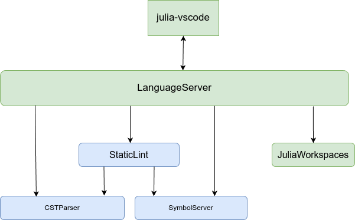

# JuliaWorkspaces.jl

Underlying engine for [LanguageServer.jl](https://github.com/julia-vscode/LanguageServer.jl) (LS), an implementation of the Microsoft Language Server Protocol for the Julia language. 
This is the current set of packages used by julia-vscode. After the ongoing refactoring only the packages in green will be used.

## Design ideas

### Planned transitions
The first transition is that we want to adopt [JuliaSyntax.jl](https://github.com/JuliaLang/JuliaSyntax.jl) for parsing and probably also its node types for representing code. Most of the LS at the moment is powered by [CSTParser](https://github.com/julia-vscode/CSTParser.jl), which has its own parsing implementation and brings the main node type along that is used throughout the LS. At the same time, we have started to use JuliaSyntax in the LS (yes, at the moment everything gets parsed twice, once by CSTParser and once by JuliaSyntax) for some things, namely the test item detection stuff. The roadmap here is that I want to completely get rid of the CSTParser parser and exclusively use the JuliaSyntax parser. The medium term plan is that we will have one parsing pass that then generates trees for the old CSTParser node types and the JuliaSyntax node types. Once we are at that stage we’ll need to spend some more time thinking about node types and what exactly is the right fit for the LS.

The second transition is towards a more functional/immutable/incremental computational model for most of the logic in the LS. At the moment the LS uses mutable data structures throughout, and keeping track of where state is mutated, and when is really, really tricky (well, at least for me). It also makes it completely hopeless that we might use multi threading at some point, for example. So this summer I started tackling that problem, and the strategy for that is that we use [Salsa.jl](https://github.com/julia-vscode/Salsa.jl) as the core underlying design for the LS. There is an awesome JuliaCon video about that package from a couple of years ago for anyone curious. So that whole design is essentially inspired by the Rust language server. The outcome of that transition will be a much, much easier to reason about data model.

### Goal
Very roughly, [StaticLint](https://github.com/julia-vscode/StaticLint.jl)/CSTParser/[SymbolServer](https://github.com/julia-vscode/SymbolServer.jl) has all the code pre these transitions, and JuliaWorkspaces has the code that is in this new world of the two transitions I mentioned above. So the division is by generation of when stuff was added to the LS, not by functionality. My expectation is that once the transition is finished, StaticLint and SymbolServer will be no more as individual packages but their code will have been incorporated into JuliaWorkspaces. The final design I have in mind is that the [LanguageServer.jl](https://github.com/julia-vscode/LanguageServer.jl) package really only has the code that implements the LSP wire protocol, but not much functionality in it, and all the functionality lives in JuliaWorkspaces. The idea being that we can then create for example CI tools that use the functionality in JuliaWorkspaces directly (like GitHub - julia-actions/julia-lint), or command line apps etc.

### Help wanted
While the refactoring of the code - a least in the beginning - should be done by the core team, help to improve 
related packages would be very welcome. For details, have a look at [#47](https://github.com/julia-vscode/JuliaWorkspaces.jl/issues/47).